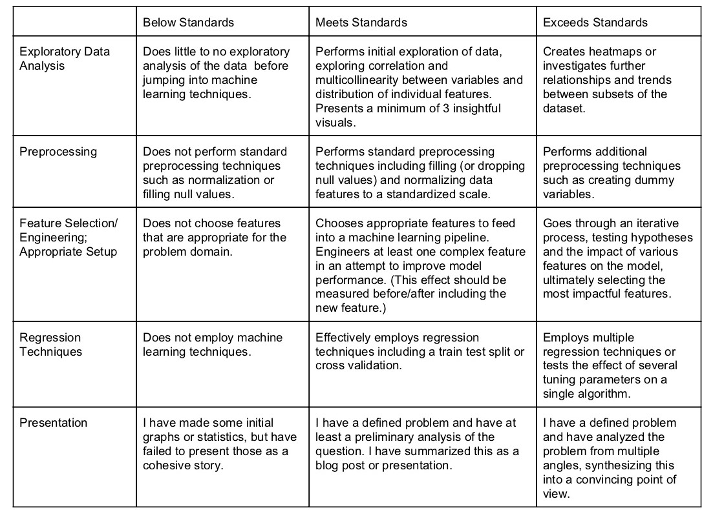

# Midterm Project

The midterm project is due on class 10. You will have class 9 to continue to work on it, but it is a good idea to continue working on it. Your final submission should include a written description of your process from preprocessing through model evaluation. As a reminder of general requirements and key areas to include, refer to the midterm rubric below.



# Regression Outline Reminder

As a reminder, here is our general outline for regression :

* Define X and y
    * y should be a continuous numeric variable
    * X should be a number of numeric features
        *X features may need substantial preproccesing including:
            * Transforming datetime values
            * Normalizing features ranges/distributions
            * Creating dummy variables
            * Ensuring there are no categorical variables coded (misleadingly) as numbers
* Train / Test Split
* Fit algorithm on training data
    * Cross Validation
    * Feature Engineering
        * Synthetic Polynomial Features / Polynomial Regression
* Evaluate Model Performance on Test Set
    * Repeat process with seperate train/test split; do results hold?
* Continue feature engineering, tuning, etc.


```python

```
